# IaC-SOC-Sample
An automated SOC sample deployed as IaC in Azure

## Overview
This Infrastructure as Code (IaC) project deploys a complete Security Operations Center (SOC) lab environment in Microsoft Azure. The lab includes both Linux and Windows managed endpoints with integrated security monitoring through Wazuh SIEM.

## Architecture
The SOC lab consists of:
- **Control Node**: Ubuntu 22.04 LTS with Wazuh server, Jenkins CI/CD, Docker, and Ansible
- **Windows Target**: Windows 11 Enterprise with Wazuh agent and OpenSSH server
- **Network**: Single VNet (10.0.0.0/16) with shared subnet (10.0.1.0/24)
- **Security**: Network Security Group with service-specific access rules
- **Management**: Auto-shutdown functionality for cost optimization

```mermaid
graph TB
    Admin[👤 Administrator] 
    
    subgraph Azure[☁️ Azure VNet 10.0.0.0/16]
        subgraph Control[🐧 Control Node - Ubuntu 22.04]
            Wazuh[Wazuh SIEM:443]
            Jenkins[Jenkins:8080]
            SSH1[SSH:22]
        end
        
        subgraph Windows[🪟 Windows 11 Target]
            Agent[Wazuh Agent]
            RDP[RDP:3389]
            SSH2[SSH:22]
        end
        
        NSG[🔒 Network Security Group<br/>Restricts external access to Admin IP]
    end
    
    %% Admin access (restricted by NSG)
    Admin -->|Secure Access| Control
    Admin -->|Secure Access| Windows
    
    %% Internal monitoring
    Agent -.->|Security Data| Wazuh
    
    %% Auto-shutdown
    Schedule[⏰ Auto-Shutdown<br/>Daily cost savings]
    Schedule -.-> Control
    Schedule -.-> Windows
    
    classDef admin fill:#c8e6c9,stroke:#2e7d32,stroke-width:2px,color:#1b5e20
    classDef azure fill:#1976d2,stroke:#0d47a1,stroke-width:2px,color:#ffffff
    classDef security fill:#f8bbd9,stroke:#c2185b,stroke-width:2px,color:#880e4f
    
    class Admin admin
    class Azure,Control,Windows azure
    class NSG,Schedule security
```



### Access Control Matrix

| Service | Port | Access | Purpose | Authentication |
|---------|------|--------|---------|----------------|
| **Control Node Access** |
| SSH | 22 | Admin IP Only | System administration | Username/Password |
| Jenkins | 8080 | Admin IP Only | CI/CD management | Web UI login |
| Wazuh Dashboard | 443 | Admin IP Only | SIEM monitoring | Web UI login |
| **Windows Target Access** |
| RDP | 3389 | Admin IP Only | Desktop administration | Windows login |
| SSH | 22 | Admin IP Only | Command line access | Username/Password |
| WinRM | 5985/5986 | Admin IP Only | PowerShell remoting | Windows authentication |
| **Internal Communication** |
| Wazuh Agent | 1514/1515 | VNet traffic | Security monitoring | Agent certificates |

## Prerequisites
- [Azure CLI](https://docs.microsoft.com/en-us/cli/azure/install-azure-cli) installed and authenticated
- [Terraform](https://www.terraform.io/downloads.html) installed (version 0.12+)
- SSH key pair for Linux VM access

## Quick Start
1. Clone this repository
2. **Authenticate with Azure:**
   ```bash
   # Login to Azure
   az login
   
   # List available subscriptions
   az account list --output table
   
   # Set the subscription you want to use
   az account set --subscription "your-subscription-id-or-name"
   
   # Verify the current subscription
   az account show
   ```
3. Copy `terraform.tfvars.example` to `terraform.tfvars`
4. Update variables in `terraform.tfvars` with your values
5. Deploy the infrastructure:
   ```bash
   terraform init
   terraform plan
   terraform apply
   ```

## Infrastructure Components

### Control Node (Ubuntu 22.04)
- **Services**: Wazuh SIEM, Jenkins, Docker, Ansible
- **Access**: SSH (port 22), Web UI (ports 8080, 9200, 5601)
- **Configuration**: Automated via cloud-init script

### Windows Target (Windows 11 Enterprise)
- **Services**: Wazuh agent, OpenSSH server
- **Access**: RDP (port 3389), SSH (port 22), WinRM (ports 5985/5986)
- **Configuration**: Automated via PowerShell script

### Network Security
- Source IP restriction for external access
- Intra-VNet communication allowed
- Service-specific port rules

## Configuration Files

### Required Files
- `terraform.tfvars` - Your deployment configuration
- `scripts/cloud-init.yaml` - Linux VM setup script
- `scripts/win11-setup.ps1` - Windows VM setup script

### Optional Files
- `scripts/cloud-init-basic.yaml` - Minimal Linux setup
- Custom cloud-init or PowerShell scripts

## Outputs
After deployment, Terraform provides:
- Public and private IP addresses
- SSH/RDP connection strings
- Web service URLs
- Network configuration details

## Management
Both VMs include auto-shutdown functionality (configurable time/timezone) to minimize costs when not in use.

For detailed auto-shutdown configuration, see: [Auto-Shutdown Configuration Guide](docs/auto-shutdown-guide.md)

## Troubleshooting
Check the scripts directory for cloud-init and PowerShell logs if deployment issues occur.
